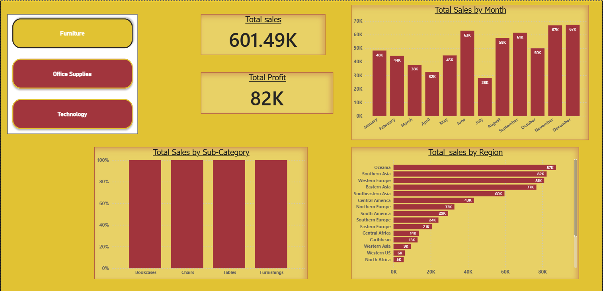

# Global Superstore Sales Dashboard (Power BI)

Power BI dashboard analyzing global sales, profit, and regional performance.

## 📊 Dashboard Preview

## 📈 Key Highlights
- Total Sales and Profit KPIs
- Monthly Sales Trend Analysis
- Regional Sales Comparison
- Category-wise Filtering

## 🧰 Tools Used
- Power BI Desktop
- DAX (Basic Measures)
- Global Superstore Dataset

## 👤 Author
Utkarsha Ravindra Tambe

